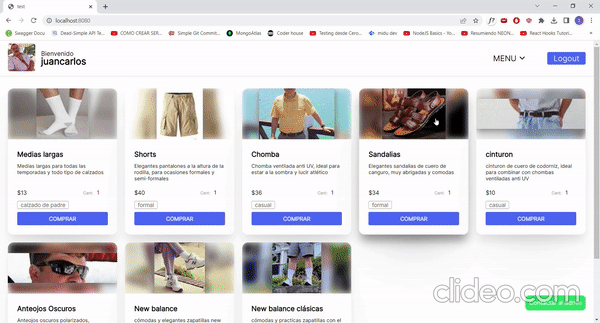
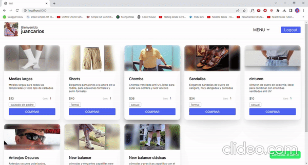

# Proyecto final BackEnd_32105-LeandroTalenton

Este es el proyecto final para el modulo de backend de CoderHouse comision 32105.


## API Reference

#### **Productos**

#### Get all products
```http
  GET /productos?category=${category}
```

| Query | Description                |
| :-------- | :------------------------- |
| `category` | **Opccional**. filtra por el query pasado |

sin un query devuelve todos los productos de la DB, con query filtra unicamente por aquellos productos cuya categoria coincida con el query.

#### Get product by id

```http
  GET /productos/:${prodId}
```

| Parameter | Description                       |
| :-------- | :-------------------------------- |
| `prodId`      | **Requerido**. Id del producto a devolver |

#### Post new product

```http
  POST /productos
```

Toma el req.body y postea un nuevo producto a la DB

#### Put product

```http
  PUT /productos/:${prodId}
```

| Parameter | Description                       |
| :-------- | :-------------------------------- |
| `prodId`      | **Requerido**. Id del producto a editar |

Toma el req.body y pisa al producto en la DB.

#### Delete product

```http
  DELETE /productos/:${prodId}
```

| Parameter | Description                       |
| :-------- | :-------------------------------- |
| `prodId`      | **Requerido**. Id del producto a borrar |

Elimina a un producto en la DB.

#
#### **Usuarios**

#### Get landing page
```http
  GET /
```

En caso de estar loggeado renderiza la pagina principal con los datos del usuario, de lo contrario redirige a la pagina de login

#### Get pagina sobreMi
```http
  GET /usuario
```
Devuelve una pagina con informacion del usuario

#### Get logOut
```http
  GET /logout
```
Elimina la sesion del usuario y redirige a /

#### Get signUp
```http
  GET /signup
```
Renderiza un formulario para registrarse como usuario

#### Post signUp
```http
  POST /signup
```
Crea el usuario en base a los datos del req.body

#### Post logIn
```http
  POST /
```
Utiliza los datos del req.body para logguear a un usuario en caso de que este usuario exista en la DB, caso contrario redirige a /

#### Post cambiarfoto
```http
  POST /cambiarfoto
```
Carga una nueva imagen al servidor y en base al usuario loggeado actualiza la ruta a su foto de perfil con la ruta de la nueva imagen.

#
#### **Carritos**

#### Get all active cart products
```http
  GET /carrito
```
Renderiza una pagina con la informacion correspondiente al carrito activo del usaurio loggeado.

#### Get thankYou screen
```http
  GET /carrito/compra
```
Renderiza una pagina de agradecimiento que luego de un plazo redirige a la vista de ordenes del usuario

#### Post postProductToActiveCart
```http
  POST /carrito/:${prodId}/productos
```

| Parameter | Description                       |
| :-------- | :-------------------------------- |
| `prodId`      | **Requerido**. Id del producto a agregar |

Agrega un producto que coincida con el param ${prodId} al carrito activo del usuario loggueado

#### Put putCartAsClosed
```http
  PUT /carrito
```

Cambia el estado del carrito activo del usuario loggueado de "active":"true" a "active":"false" y luego redirige a la pagina /carrito/compra

#### Delete deleteProductFromActiveCart
```http
  DELETE /carrito/:${prodId}/productos
```

| Parameter | Description                       |
| :-------- | :-------------------------------- |
| `prodId`      | **Requerido**. Id del producto a borrar |

Borra el producto que coincide con la id indicada del carrito activo del usuario loggueado.


#
#### **ordenes**

#### Get getUserOrders
```http
  GET /ordenes
```

Renderiza una pagina con un listado de las ordenes que realizo el usuario

#### Get getOrderData
```http
  GET /ordenes/:${id_orden}
```

| Parameter | Description                       |
| :-------- | :-------------------------------- |
| `id_orden`      | **Requerido**. Id de la orden que se va a renderizar |

Renderiza una pagina con la informacion de la orden cuyo id corresponda con el ${id_orden} (solo en caso de que la orden corresponda al usuario loggueado)


#
#### **Chat**

#### Get getChatGeneral
```http
  GET /chat
```

Renderiza una pagina con el chat general

#### Get getChatIndividual
```http
  GET /chat/:${destinatario}
```

| Parameter | Description                       |
| :-------- | :-------------------------------- |
| `destinatario`      | **Requerido**. Nombre del usuario con el que se quiere chatear |

Renderiza una pagina con un chat individual con el usuario cuyo nombre coincida con el ${destinatario}


#
#### **Info**

#### Get getInfo
```http
  GET /info
```

Renderiza una pagina con la informacion del servidor


## Usage/Examples

#### *Gif de compra de productos*



#### *Gif de filtrado de productos y uso del chat*



## Environment Variables

To run this project, you will need to add the following environment variables to your .env file

#### This variables can be found on the .env_example file included
```javascript
TIPO=MONGO

# ENTORNO=DESARROLLO
DES_HOST_SPECIFIER=localhost:nnnn
DES_AUTH_DATABASE=database

# ENTORNO=PRODUCCION
DB_SESSION_USER=INSERT_DB_SESSION_USER_HERE
DB_SESSION_PASS=INSERT_DB_SESSION_PASS_HERE
DB_SESSION_CLUSTERNAME=INSERT_DB_SESSION_CLUSTERNAME_HERE
DB_SESSION_NAME=INSERT_DB_SESSION_NAME_HERE
```


## Run Locally

Clone the project

```bash
  git clone https://link-to-project
```

Go to the project directory

```bash
  cd my-project
```

Install dependencies

```bash
  npm install
```

Start the server


```bash
  npm run start
```
or

```bash
  npm run start-desarrollo
```
--> *It is necessary for this project to be run locally to have mongoDBCompass installed*

#


## Comandos:


### node:
argumentos:
 -p port. Puerto a utilizar
 -m method. Metodo a utilizar (CLUSTER || FORK)

ej: node index.js -p 8081 -m CLUSTER


 ### forever
argumentos:
 -w watch. Puerto a utilizar
 -m method. Metodo a utilizar (CLUSTER || FORK)

ej. forever start index.js
ej. forever -w start index.js -m CLUSTER

verificar procesos forever activos:
forever list

terminar procesos forever:
forever stapall


### pm2
Modo fork:
pm2 start index.js --name="fork-lt"

Modo cluster:
pm2 start index.js --name="cluster-lt" -i <n> -- --port=8081

listar:
pm2 list

detener:
pm2 stop all

borrar:
pm2 delete all


## Ejecucion mediante nginx

### En pm2 abrir ejecutar los siguientes comandos:
pm2 start index.js --name="fork-lt0" -- --port=8080
// pm2 start index.js --name="fork-lt1" -i 3 -- --port=8081 <-- esto era para la primer parte
pm2 start index.js --name="fork-lt2" -- --port=8082
pm2 start index.js --name="fork-lt3" -- --port=8083
pm2 start index.js --name="fork-lt4" -- --port=8084
pm2 start index.js --name="fork-lt5" -- --port=8085

### En nginx
copiar el contenido de nginx.conf en los archivos locales conf/nginx.conf
ejecutar nginx.exe

### En un explorador
Acceder a localhost:80 --> sera servido el contenido de localhost:8080
Acceder a localhost:80/api/randoms --> sera servido alguno de los forks de los puertos 8082 a 8085